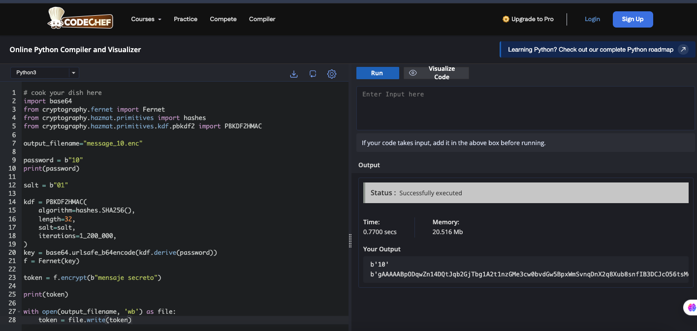

# ¡Resuelve los retos!

## Reto 1
Accede a la web de [cryptii](https://cryptii.com) y descifra el siguiente mensaje cifrado "¡Ub YUJ Sqibfj Rfljfef ub cuzfi!" 

Nota 1.1: Sí, no te hemos dado la clave :D ... tendrás que apañarte jeje

Nota 1.2: Tampoco te decimos el algoritmo de cifrado... pero tampoco hemos visto tantos, ¿no?

Nota 1.3: Ojo, que si el texto en claro estaba en espaÑol... a lo mejor echas de menos algo :S

## Reto 2
Usando la web de [cryptii](https://cryptii.com) de nuevo, ¿deberías aceptar el mensaje "PARQUE, 20:00" 
si viene acompañado por un código de autenticación de mensajes que comienza por "42 AE E7 97" y que ha sido calculado con HMAC SHA-256 y la Clave(key)=1234?

Nota 2.1: La entrada a la función HMAC debe ser en bytes... pero el mensaje que tienes es texto. ¿Sabías que puedes añadir bloques adicionales a la cadena de procesamiento de cryptii pulsando en el círculo que contiene un '+'? Busca a ver cómo puedes pasar de 'texto' a 'bytes' antes de pasarlo a la función HMAC. 

## Reto 3
Ahora nos dan un mensaje cifrado con un cifrador "ya-en-serio"... ¡A ver si eres capaz de descifrarlo con [cryptii](https://cryptii.com)! 

Nota 3.1 Ojo, que el mensaje una vez descifrado debe poder leerse... tú sabrás cómo podrás pasar de bytes a texto... 
Puedes usar [BinaryHexConverters](https://www.binaryhexconverter.com/hex-to-ascii-text-converter) 
o añadir una "caja" más en el flujo de cryptii  para procesar los bytes en texto ASCII.

### DATOS

algoritmo := AES-128 (block cipher)

modo de operación := CTR (counter)

key := 00 11 22 33 44 55 66 77 88 99 aa bb cc dd ee ff

iv := 00 01 02 03 04 05 06 07 08 09 0a 0b 0c 0d 0e 0f

mensaje cifrado (bytes en hexadecimal) : =  77 ea d2 39 55 1c 7c 7e 
                                            fc fa ec 9f b0 ce 91 76 
                                            65 27 f8 63 fc f0 75 1f 
                                            a1 3c d5 04 53 d1 f4 8e 
                                            a9 2d b5 17 4a a9 ff ca 
                                            5e 53 0c 86 59 37 d1 da 
                                            06 d8 1f b3 79 cd 76 74 25

## Reto 4 (¡solo para l@s más motivad@s!)
AVISO: Es necesario saber "algo" de Python para resolver este reto.

[pyca/cryptography](https://cryptography.io) es una librería para Python que implementa herramientas criptográficas. Entre las herramientas que ofrece están los Fernets,
que cifran y autentican un mensaje que se le pase en bytes, y PBKDF2, que genera una clave simétrica de alta calidad a partir de una contraseña común. 

En la sección de su página web [Using Fernet with passwords](https://cryptography.io/en/latest/fernet/#using-passwords-with-fernet) explica como generar la clave
y usar el Fernet. 

Y en este mismo repositorio tienes el archivo de Python [test_Fernet.py](https://github.com/aigonzal/talks_awareness/blob/main/test_Fernet.py) que ilustra 
cómo generar una clave para el Fernet y usarla para cifrar un mensaje y guardarlo en un archivo llamado message.enc. 

¿Eres capaz de revertir el cifrado del programa test_fernet.py para descifrar el mesaje cifrado que se encuentra en el archivo 
[mensaje_100.enc](https://github.com/aigonzal/talks_awareness/blob/main/message_100.enc)? 

Nota 4.1: Podría no ser así... pero no somos tan malign@s, esta vez hemos usado para cifrar el mensaje la misma pwd y el mismo salt que se utilizan en test_Fernet.py... ya el mensaje no, claro :X ese es el que tienes que averiguar

Nota 4.2: Si no quieres liarte instalando Python o la librería pyca/cryptography en tu dispositivo (o no puedes instalarlos), puedes utilizar el intérprete de Python online [CodeChef](https://www.codechef.com/python-online-compiler). En la siguiente captura de pantalla puedes ver el resultado de copiar en el marco de la izquierda el código Python contenido en test_Fernet.py y ejecutarlo pinchando el botón Run con fondo azul. 

Si no quieres trabajar con ficheros (que puede ser difícil con intérpretes online o a lo mejor no estás acostumbrad@), copia directamente el contenido del fichero (mensaje cifrado) y guárdalo en una variable en tu programa (ojo que tienes que poner primero una 'b' y entrecomillar la secuencia de caracteres después paraa que funcione bien). Algo así: 

<code>mensaje_cifrado = b"gAAAAABpN0bL4RNb4dQKevdPZy8bLv9lNZais0opUkkTMYHwLLcxxxTknpNOiIl48tlGam3kXQYr1CGDYbLIXG2S6FiwlzypSGKrAVX2_GAO3o5aIqoM8xwn9f7LG3FTix1Onn2AM2cE"</code>

